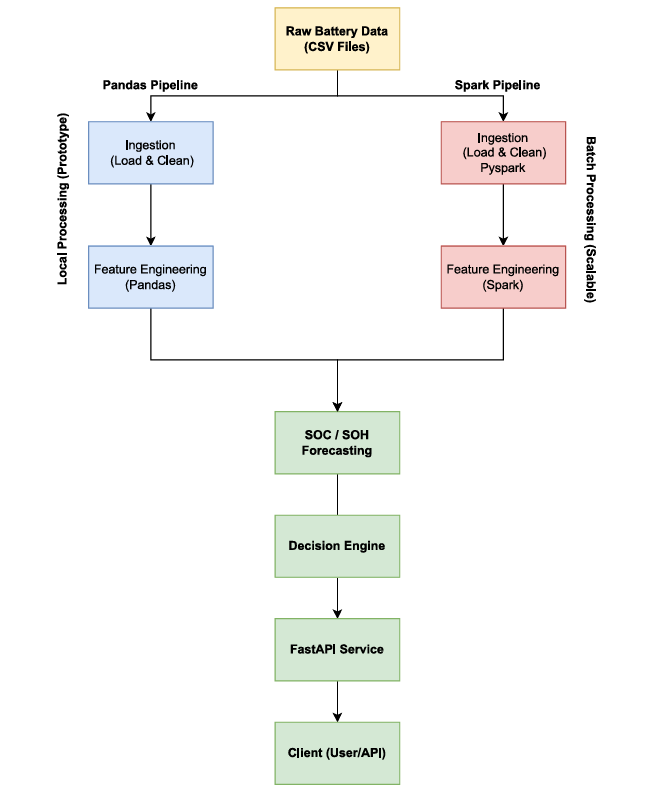

# 🔋 Battery Intelligence System

An end-to-end data engineering and analytics system for lithium-ion battery monitoring, feature engineering, health forecasting (SOH), and rule-based decision intelligence.

This project simulates a real-world battery analytics pipeline used in EVs and energy systems, integrating data processing, modeling, backend APIs, and visualization.

---

## 🚀 Key Features

* ⚡ Time-series battery data ingestion and cleaning
* 🧠 Feature engineering (charge/discharge cycle metrics)
* 📉 SOH forecasting using regression models
* 🛠 Rule-based decision engine (health, thermal & usage analysis)
* 🌐 FastAPI backend for serving predictions
* 📊 Streamlit dashboard for visualization
* ⚙️ Scalable pipeline design with Spark support

---

## 🏗️ System Architecture

```
Raw Data → Ingestion → Feature Engineering → Forecasting → Decision Logic → API → Dashboard
```

* **Pandas Pipeline** → rapid prototyping
* **Spark Pipeline** → scalable batch processing
* **FastAPI** → exposes model outputs
* **Streamlit** → interactive UI

---

## 📂 Project Structure

```
battery-intelligence-system/
│
├── src/
│   ├── ingestion/        # Data loading & cleaning
│   ├── features/         # Feature engineering logic
│   ├── forecasting/      # SOH prediction models
│   ├── decision/         # Health & anomaly rules
│   ├── api/              # FastAPI service
│   ├── spark_jobs/       # Spark-based processing
│
├── notebooks/            # Exploratory analysis
├── streamlit_app/        # Dashboard UI
├── data/                 # Sample input data
├── output/               # Generated results
│
├── run_pipeline.py       # End-to-end pipeline runner
├── requirements.txt
└── README.md
```

---

## ⚙️ Pipeline Execution

Run the complete system:

```bash
python run_pipeline.py
```

This will:

* Process raw battery data
* Generate engineered features
* Predict SOH and remaining cycles
* Apply decision logic
* Save final results to `/output/final_results.csv`

---

## 🌐 API Usage

Start the FastAPI server:

```bash
uvicorn src.api.main:app --reload
```

Example endpoints:

* `/predict`
* `/analyze`
* `/recommend`

---

## 📊 Dashboard

Run Streamlit:

```bash
streamlit run streamlit_app/app.py
```

Features:

* Battery health visualization
* SOH trends
* Alerts & recommendations

---

## 🧠 Decision Logic

The system evaluates:

* Battery health (SOH thresholds)
* Remaining useful life (RUL)
* Thermal conditions
* Usage efficiency

Outputs:

* Health status (Healthy / Moderate / Degrading)
* Risk flags (thermal / usage)
* Maintenance recommendations

---

## 🛠 Tech Stack

* Python (Pandas, NumPy)
* Scikit-learn (Regression Models)
* FastAPI (Backend API)
* Streamlit (Frontend Dashboard)
* PySpark (Scalable processing)

---

## 📈 Future Improvements

* Real-time streaming pipeline (Kafka)
* Advanced ML models (LSTM, XGBoost)
* Deployment (Docker + Cloud)
* Elasticsearch integration for search & analytics


## 🏗️ Architecture Diagram


---

## 👨‍💻 Author - Satyam Lalchandani

Built as a real-world data engineering + ML system focused on energy and EV battery analytics.

